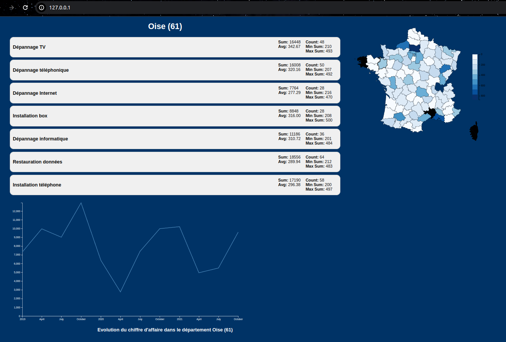
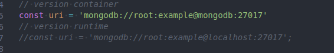
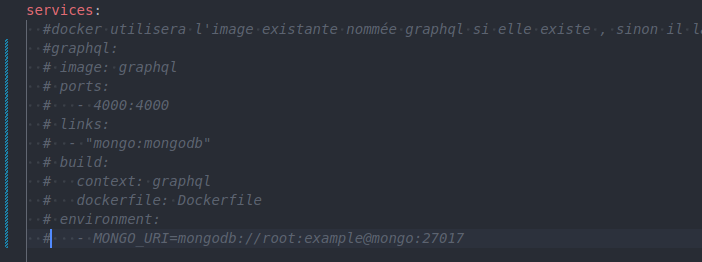

# ProjetGraphQLD3JsAmirathRomain

# Introduction
Ce projet contient une pile de containers permettant de lancer une visualisation de données de ventes, étudiées pendant la première partie d'une UE de base de donnée avancées sur les datawarehouse.

 La pile de containers comprend :      
 
 - une base de données MongoDB contenant les données de ventes
 - un serveur Apache contenant l'UI en React déjà buildé
 - un container GraphQL contenant le code du serveur et les résolveurs.
 - un container mongo express pour gérer la base de données MongoDB

 Nous avons fait le choix d'utiliser React pour notre UI pour ce projet car on devait se remettre à jour avec react pour un autre projet en parallèle qui utilise OHIF, une librairie de visualisation d'images médicales.

 Nous avons adapté le code du professeur qui utilisait D3, pour react, qui contient un package D3. 

 Nous nous sommes réparties les tâches : 
 Romain s'est chargé de faire l'UI avec React et la liaison avec GraphQL.
 Amirath s'est chargé de faire le serveur GraphQL et les résolveurs.

 Une petite erreur de notre part: il y a un petit soucis au niveau de la corse, nous avons mal fait l'implémentation json et donc avec notre conversion en int on ne prend pas en compte 2A ou 2B et donc vu que l'on n'utilise pas le code département du fichier json, l'aisne est considéré comme la corse il me semble ou alors les données seraient peut-être décalé via le fichier json des départements, il faudrait modifier cela mais nous n'avons pas eu le temps de le faire, étant occupé par nos autres projets.

 Pour aller plus loin dans ce projet dans le futur dans quelques années, on pourrait faire en sorte que l'utilisateur entre un prompt et que une IA génère une nouvelle visualisation de données en fonction de ce prompt. On pourrait aussi faire en sorte que l'utilisateur puisse choisir les données qu'il veut visualiser, et que l'IA génère une visualisation en fonction de ces données, en adaptant les requêtes graphQL, en utilisant une nouvelle technologie à base d'algorithme de Monté-Carlo boosté à l'IA.

# Un exemple de la visualisation de données du fichier sales.bson

# Pour le professeur, ou le client qui veut lancer la pile de containers:

Se placer dans le dossier racine du projet où se trouve le fichier stack.yml
Lancer les containers:
```
docker-compose -f stack.yml up -d --build                                                                                                                                           
```
Attention, si vous avez fait des modifications ou avez déjà des images comportant ces noms dans votre docker, il faut supprimer ces images avant de faire la commande docker-compose. Si vous êtes débutant, je conseille de faire simplement `docker system prune -a` pour supprimer tous les containers inutilisés et nettoyer le système. Attention cela supprimera tous vos containers et images sur Docker. Vous pouvez faire `docker-compose -f stack.yml down` pour arrêter les containers.

Attention, le port 80 doit être libre sur votre machine, sinon il faudra changer le port dans le fichier stack.yml.

Insérer les données présentes d'exemple du fichier sales.bson: (le fichier sales.bson est fourni à la racine du projet)
```
docker exec -i mongo-dev sh -c 'mongoimport -d bda -c sales --authenticationDatabase admin -u root -p example' < sales.bson
```

## Pour accéder à l'interface
L'UI est accessible sur l'adresse de loopback de votre machine, http://localhost 
ou http://127.0.0.1

## Pour accéder au playground GraphQL et au mongo-express
- L'url du playground est : http://localhost:4000
- L'url du mongo-express est : http://localhost:8081
    - **login**: root
    - **password**: example


## Pour arrêter la pile de containers :
```
docker-compose -f stack.yml down
```

# Pour les développeurs qui veulent modifier / améliorer le code afin de contribuer

Il vous faudra commenter la partie service graphql de la pile et modifier le fichier index.js pour lancer le serveur graphql en local. Il vous suffira de commenter l'url de mongo et de décommenter l'url de mongo en local.




Veillez également à commenter la dépendance à graphQL pour le service apache.

## GraphQL
Pour lancer le serveur GraphQL local :
```
npm init es6 --yes
npm install mongodb @apollo/server graphql --save  --no-bin-links
node index.js
```

## React
Pour lancer le serveur React local :
```
npm install
npm start
```

Pour faire le build de l'LUI :
```
npm run build
```
Il y a également un README dans le dossier ui-ventes qui explique tout cela en détail.


## Si jamais il y a un problème de CORS
### Dans firefox:
Aller à l'URL suivante: about:config
security.fileuri.strict_origin_policy true -> false 

## Projet réalisé par


**Romain Andres 21904263**  
[](https://github.com/VendenIX)

**Amirath Fara Orou Guidou 22012235**  
[](https://github.com/Amirath6)


## Encadré par nos enseignants de l'université de Caen Normandie

**Bruno Zanuttini**  
https://zanuttini.users.greyc.fr/

**François Rioult**  
